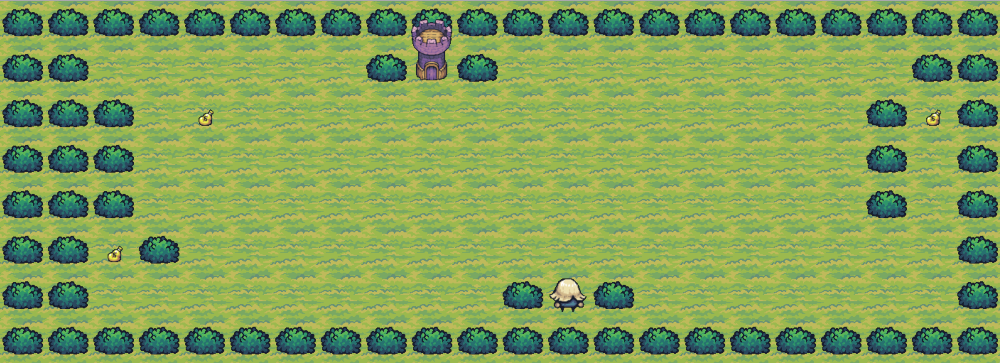
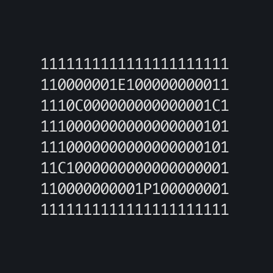

# 42 Madrid project: so_long

## The objective
This project is a tiny 2D game. Its purpose is to practice with textures, sprites, and some other very basic gameplay elements.  

The proyect uses [Minilibx](https://github.com/42Paris/minilibx-linux), a graphical library created by [42 Paris](https://github.com/42Paris) for 42 students. If you need more documentation about this library you can click [here.](https://harm-smits.github.io/42docs/libs/minilibx)  

## How to install
Just 4 simple steps:  
  1. Copy the repositoire: `git clone https://github.com/telufulu/so_long telufulu_so_long`
  2. Go to the directory: `cd telufulu_so_long`
  3. Compile the program: `make`
  4. You have a lot of diferent maps in assets/maps/, but you can start trying this command: `./so_long assets/maps/example.ber`  

To "unistall" it, just execute the command `make fclean`

## How to play
The player’s goal is to collect every collectible present on the map, then escape chosing the shortest possible route.  
You can use W, A, S, D keys to move, or the arrow keys.  
Once you collect all the coins, you can reach the exit and finish the game. In this case, the exit is the purple tower and the collectives are coin bags.  

If you want to exit the game early, just press ESC key.  

## Custom maps
You can draw you own map, but it must obey some rules:  
1. The map can be composed of only these 5 characters:
   - 0 for an empty space,
   - 1 for a wall,
   - C for a collectible,
   - E for a map exit,
   - P for the player’s starting position.
3. It must contain 1 exit, at least 1 collectible, and 1 starting position to be valid.
4. It must be rectangular.
5. It must be closed/surrounded by walls.
6. It must end with the extension .ber  

Here you can see and example of a map   

> If you need something, you can reach me by [Slack](https://42born2code.slack.com/team/U05SF7MGZ9N) or [email me](mailto:teresa@teresalufuluabo.es)
